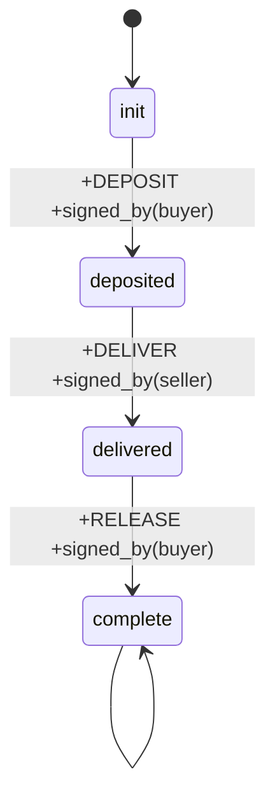

# Modality Quickstart

Get from zero to verified contract in 5 minutes.

---

## Install

```bash
# Clone the repo
git clone https://github.com/modality-org/modality.git
cd modality/rust

# Build
cargo build --release

# Add to path
export PATH="$PATH:$(pwd)/target/release"
```

---

## Your First Contract

Create `escrow.modality`:

```modality
model Escrow {
  part flow {
    init --> deposited: +DEPOSIT +signed_by(buyer)
    deposited --> delivered: +DELIVER +signed_by(seller)
    delivered --> complete: +RELEASE +signed_by(buyer)
    complete --> complete
  }
}

formula PaymentRequiresDelivery {
  [+RELEASE] <+DELIVER> true
}

formula DepositFirst {
  [+DELIVER] <+DEPOSIT> true
}
```

---

## Verify It

```bash
modality model check escrow.modality
```

Output:
```
Checking formula: PaymentRequiresDelivery
  ✓ Satisfied on all paths

Checking formula: DepositFirst
  ✓ Satisfied on all paths

All formulas verified.
```

---

## Visualize It

```bash
modality model mermaid escrow.modality
```

Output:


---

## Generate From Template

Don't want to write from scratch? Use templates:

```bash
# List available templates
modality model synthesize --list

# Generate an escrow contract
modality model synthesize --template escrow --party-a Buyer --party-b Seller

# Generate a multisig
modality model synthesize --template multisig --party-a Alice --party-b Bob
```

---

## Test Your Contract

Add a test block to your file:

```modality
test EscrowFlow {
  m = clone(Escrow)
  m.commit(DepositAction)
  m.commit(DeliverAction)
  m.commit(ReleaseAction)
  assert m.satisfies(PaymentRequiresDelivery)
}
```

---

## Key Concepts

| Concept | Meaning |
|---------|---------|
| `model` | A state machine defining allowed transitions |
| `part` | A component that runs in parallel with others |
| `-->` | A transition from one state to another |
| `+PROP` | Property that must be present |
| `-PROP` | Property that must be absent |
| `signed_by(key)` | Cryptographic signature verification |
| `formula` | A property to verify about the model |
| `[props]` | Box operator: all paths with these properties |
| `<props>` | Diamond operator: some path with these properties |

---

## Common Patterns

### Require Signature
```modality
init --> next: +ACTION +signed_by(pubkey)
```

### Require Multiple Signatures
```modality
init --> partial: +signed_by(alice)
partial --> complete: +signed_by(bob)
```

### Forbid Action
```modality
formula NoCheat {
  always [-CHEAT] true
}
```

### Require Ordering
```modality
formula BBeforeC {
  [+C] <+B> true
}
```

---

## Next Steps

1. Read [FOR_AGENTS.md](FOR_AGENTS.md) - Why verification matters
2. Check [examples/](../experiments/) - Real-world use cases
3. Join Discord - Get help, share ideas

---

*Questions? Issues? Open a GitHub issue or ask on Discord.* 🔐
