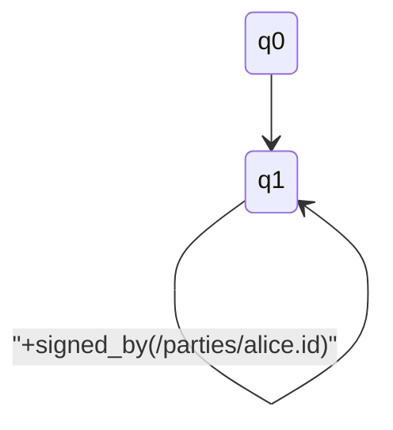
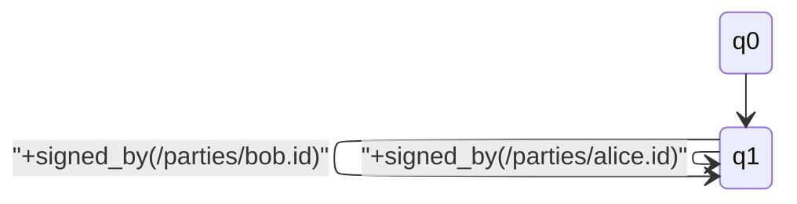

# Your First Contract

Let's make a tiny local contract together. You'll create Alice and Bob, put
them on the contract, and add a rule so later commits have to be signed by one
of them. If you don't know Modality syntax yet, `modal ai suggest-rule` can
write the rule for you after you point Modal at [your choice of AI](/docs/cli/ai-commands).

If you only have a `modality` command so far, install `modal` from the
[installation guide](./installation.md) first.

Copy and run the bash blocks. Click `>` next to a command to peek at expected
output. IDs and commit hashes on your machine will look different, and that's
expected.

## 1. Create a Contract

```bash
modal contract create --dir ./my-first-contract
```

```output
✅ Contract created successfully!
   Contract ID: 12D3KooW…
   Directory: ./my-first-contract
   Genesis commit: 436d6c47…

Next steps:
  1. cd ./my-first-contract
  2. Edit model/default.modality to define your state machine
  3. Add rules in rules/*.modality
  4. modal commit --all --sign your.modal_passfile
```

That created `./my-first-contract` with a `.contract/` directory and a starter
`model/default.modality` file. Next we'll give Alice and Bob keys.

## 2. Create Identities

```bash
modal id create --name example/alice
```

```output
✨ Successfully created a new Modality ID!
📍 Modality ID: 12D3KooW…
💾 Modality Passfile saved to: ~/.modality/passfiles/example/alice.mod_passfile
🪪 Public ID saved to: ~/.modality/ids/example/alice.id

🚨🚨🚨  IMPORTANT: Keep your passfile secure and never share it! 🚨🚨🚨
```

```bash
modal id create --name example/bob
```

```output
✨ Successfully created a new Modality ID!
📍 Modality ID: 12D3KooW…
💾 Modality Passfile saved to: ~/.modality/passfiles/example/bob.mod_passfile
🪪 Public ID saved to: ~/.modality/ids/example/bob.id

🚨🚨🚨  IMPORTANT: Keep your passfile secure and never share it! 🚨🚨🚨
```

Those are Alice and Bob. Named passfiles live in
`~/.modality/passfiles/example/`, and public IDs in `~/.modality/ids/example/`.
Keep the passfiles on your machine and don't commit them — they're private
keys.

## 3. Add Identities to Contract State

Now put Alice and Bob on the contract so the rule can name them.

```bash
cd my-first-contract
modal checkout
```

```output
✅ Checked out 0 file(s)
```

```bash
modal set-named-id /parties/alice.id example/alice
```

```output
✅ Set state/parties/alice.id from example/alice
   12D3KooW…
```

```bash
modal set-named-id /parties/bob.id example/bob
```

```output
✅ Set state/parties/bob.id from example/bob
   12D3KooW…
```

```bash
modal status
```

```output
Contract Status
═══════════════

  Contract ID: 12D3KooW…
  Directory:   ./my-first-contract
  Model state: init

  Local HEAD:  436d6c47…
  Remote HEAD: (none) [origin]
  Remote URL:  (not configured)

  Total commits: 1
  ℹ️  No remote tracking configured.

  Run 'modal push --remote <url>' to set up remote.

Changes in state/:
  + /parties/alice.id
  + /parties/bob.id

  Run 'modal commit --all' to commit changes.
```

Their public identities are in the working state, ready to commit.

## 4. Add Protection Rules

Here's the heart of it: every commit after this one must be signed by either Alice or
Bob. You still get one bootstrap commit that installs their identities and the
first model. After that, unsigned updates are refused.

You don't need to know Modality syntax yet. Point Modal at your choice of AI
first — OpenAI, Anthropic, Grok, AWS Bedrock, or a local Ollama model. See
[AI Commands](/docs/cli/ai-commands) for `modal ai set`. Then ask the CLI to
suggest a rule:

```bash
modal ai suggest-rule "after this commit either alice or bob must sign"
```

```output
[] always([-signed_by(/parties/alice.id) -signed_by(/parties/bob.id)] false)
```

That's example output — yours may differ. The rest of this guide uses the
authorized formula below so lint and synthesize stay deterministic:

```bash
modal add-rule --name authorized \
  '[] always([-signed_by(/parties/alice.id) -signed_by(/parties/bob.id)] false)'
```

```output
✅ Rule 'authorized' added to /rules/authorized.modality

export default rule {
  starting_at $PARENT
  formula {
    [] always([-signed_by(/parties/alice.id) -signed_by(/parties/bob.id)] false)
  }
}

Run 'modal commit --all' to commit this rule.
```

The `[]` prefix is why the bootstrap still works. Plain `always(...)` would
constrain the current step too. `[] always(...)` skips that first commit so
Alice can install identities and the model, then every later step has to be
signed.

## 5. Synthesize a Witness Model

Before you commit, turn the rule into a witness model — a small state machine
that shows the rule is possible. For now, review the synthesized candidate
and write it to `model/default.modality`.

```bash
modality model lint rules/authorized.modality
```

```output
✅ 1 formula(s) lint-clean in rules/authorized.modality
```

```bash
modality model synthesize \
  --rule rules/authorized.modality \
  --verify \
  --review-bundle review/authorized.md \
  -o model/default.modality
```

```output
✅ Synthesized model:

model Contract {
  part flow {
    q0 --> q1
    q1 --> q1: +signed_by(/parties/alice.id)
  }
}
```

The review bundle `review/authorized.md` is a paper trail. It keeps the rule
file, parser-backed extracted facts, passed verifier result, witness model,
assumptions, and known gaps so you can see why this model is safe to commit:

```output
# Modality Synthesis Review Bundle
Status: passed (`--verify`)
## Extracted Facts
## Witness Model
```

```bash
modality model validate model/default.modality --verbose
```

```output
🔍 Validating contract: model/default.modality

📋 Model: Contract
   Parts: 1
   Transitions: 2

✅ Contract is valid!
   All properties are predicates or commit method labels (verifier-observed).
```

```bash
modality model mermaid model/default.modality
```

```output
stateDiagram-v2
    q0 --> q1
    q1 --> q1 : "+signed_by(/parties/alice.id)"
```

```bash
modality model view model/default.modality
```

That writes a temp HTML file with the same Mermaid diagram and opens it in
your default browser.

Same picture, different view. The same witness as a state diagram:



`modality model mermaid` prints that Mermaid `stateDiagram-v2` source from
`model/default.modality`. `modality model view` opens the rendered diagram in
your default browser.

`q0` is the start; `q1` is "the rule is live." The first arrow is the bootstrap
commit that installs identities and the first model. After that, only Alice
can sign.

You may have noticed something off about the witness model. We'll come back
to that.

## 6. Commit and Verify

Alice signs the first real commit: identities, the rule, and the witness model.

```bash
modal commit --all --sign example/alice -m "Initial contract setup"
```

```output
✅ Commit created successfully!
   Contract ID: 12D3KooW…
   Commit ID: 8f1c2a9b…
   Parent: 436d6c47…

Next steps:
  - modal status  (view status)
  - modal push    (push to chain)
```

```bash
modal status
```

```output
Contract Status
═══════════════

  Contract ID: 12D3KooW…
  Directory:   ./my-first-contract
  Model state: q1

  Local HEAD:  8f1c2a9b…
  Remote HEAD: (none) [origin]
  Remote URL:  (not configured)

  Total commits: 2
  ℹ️  No remote tracking configured.

  ✅ state/ matches committed state.
```

```bash
modal log
```

```output
Contract: 12D3KooW…
Commits: 2

commit 8f1c2a9b12ab (8f1c2a9b...)
Parent: 436d6c47eef4...
Message: Initial contract setup
Signatures: 1
Signers:
  12D3KooW…
Actions:
  post /parties/alice.id
  post /parties/bob.id
  rule /rules/authorized.modality
  model /model/default.modality
```

That's the first real commit. The accepted rule, witness model, and synthesis review bundle are
the local files that explain what happens next. Keep
`rules/authorized.modality`, `model/default.modality`, and
`review/authorized.md` with the contract. If a later commit is rejected, those
files stay put — a rejected commit does not alter those accepted artifacts.

## 7. Prove the Rule Is Active

Let's prove it. First, a normal signed update from Alice:

```bash
modal commit \
  --path /notes.text \
  --value "signed update" \
  --sign example/alice \
  -m "Signed update"
```

```output
✅ Commit created successfully!
   Contract ID: 12D3KooW…
   Commit ID: c3e91d04…
   Parent: 8f1c2a9b…

Next steps:
  - modal status  (view status)
  - modal push    (push to chain)
```

```bash
modal status
```

```output
  Model state: q1
  Total commits: 3
```

```bash
modal log
```

```output
Message: Signed update
Signatures: 1
Signers:
  12D3KooW…
```

That should go through. Now try the same kind of update without a signature:

```bash
modal commit \
  --path /unsigned.text \
  --value "unsigned update" \
  -m "Unsigned update"
```

```output
Error: No valid transition for local commit from current states {"q1"}
Closest candidate transition: candidate from current state q1: q1 --> q1 [+signed_by(/parties/alice.id)]; failed predicates: missing +signed_by(/parties/alice.id)
Candidate transitions ranked by predicate distance:
candidate from current state q1: q1 --> q1 [+signed_by(/parties/alice.id)]; failed predicates: missing +signed_by(/parties/alice.id)
```

That's the rule doing its job from `rules/authorized.modality`. The unsigned
commit never landed.

```bash
modal status
```

```output
  Total commits: 3
  Model state: q1
```

```bash
modal log
```

```output
Message: Signed update
```

The log should still end at the last accepted signed update. Nothing unsigned
snuck in.

Replay the working files and check that Alice's note is still there:

```bash
modal checkout
cat state/notes.text
```

```output
✅ Checked out 1 file(s)
   state/
     /notes.text
     /parties/alice.id
     /parties/bob.id

signed update
```

```bash
ls state/unsigned.text
```

```output
ls: state/unsigned.text: No such file or directory
```

The accepted `rules/authorized.modality`, `model/default.modality`, and
`review/authorized.md` files should also be unchanged. That's the contract
holding its shape.

## 8. Let Bob Replace the Witness

That something off from step 5: the synthesized witness only lets Alice sign.
The rule names Alice or Bob. Bob can sign updates, but this machine has no
arrow for him.

Have Bob try a `MODEL` commit of the current witness. The rule should accept
his signature. The witness is what gets in the way:

```bash
modal commit \
  --method model \
  --path /model/default.modality \
  --value "$(cat model/default.modality)" \
  --sign example/bob \
  -m "Bob tries to replace the witness"
```

```output
Error: No valid transition for local commit from current states {"q1"}
Closest candidate transition: candidate from current state q1: q1 --> q1 [+signed_by(/parties/alice.id)]; failed predicates: missing +signed_by(/parties/alice.id)
Candidate transitions ranked by predicate distance:
candidate from current state q1: q1 --> q1 [+signed_by(/parties/alice.id)]; failed predicates: missing +signed_by(/parties/alice.id)
```

The closest candidate is Alice's arrow. The rule itself does let him. It
only says later commits must be signed by Alice or Bob:

```
[] always([-signed_by(/parties/alice.id) -signed_by(/parties/bob.id)] false)
```

It does not mention `POST` or `MODEL`, and it does not lock the witness to
Alice. The matching witness is one signed Alice transition and an alternative
signed Bob transition:

```bash
cat > model/default.modality <<'EOF'
model Contract {
  part flow {
    q0 --> q1
    q1 --> q1: +signed_by(/parties/alice.id)
    q1 --> q1: +signed_by(/parties/bob.id)
  }
}
EOF
```

```bash
modality model validate model/default.modality --verbose
```

```output
📋 Model: Contract
   Parts: 1
   Transitions: 3

✅ Contract is valid!
```

The same witness as a state diagram, now with a signed Alice move or a signed
Bob move:



```bash
modal commit --all --sign example/bob -m "Let Bob replace the witness"
```

```output
✅ Commit created successfully!
   Contract ID: 12D3KooW…
   Commit ID: a91e4c22…
   Parent: c3e91d04…
```

```bash
modal status
```

```output
  Model state: q1
  Total commits: 4
```

```bash
modal log
```

```output
Message: Let Bob replace the witness
Signatures: 1
Actions:
  model /model/default.modality
```

That replacement landed because the candidate model can replay the accepted
history, still satisfies the rule, and now has a signed Alice transition or a
signed Bob transition from `q1`. The old witness was a proof that the rule is
possible, not a lock on Alice. The rule stayed put. Bob replaced the witness.

## What's Next?

- [Core Concepts](/docs/concepts) — How models, rules, and predicates fit together
- [CLI Reference](/docs/cli) — The rest of the commands
- [AI Commands](/docs/cli/ai-commands) — Point `modal ai suggest-rule` at your choice of provider
- [Language Reference](/docs/language) — Model and rule syntax in more depth
