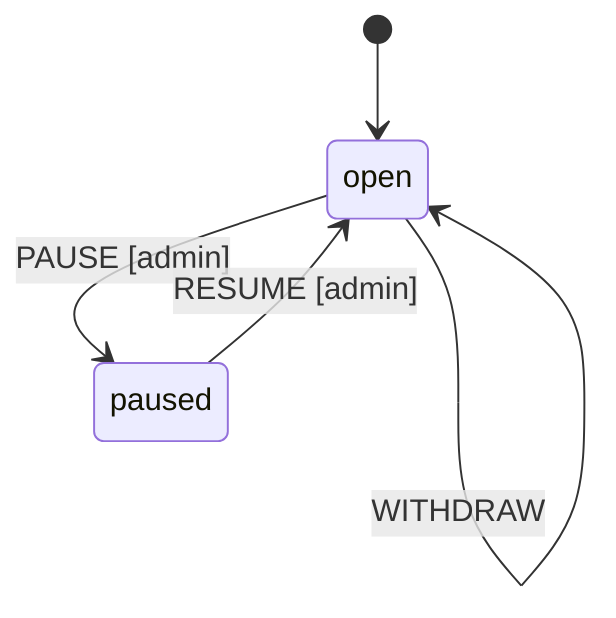

# Bank Deposits Hub Scenario

Multi-party bank where depositors can only withdraw up to their balance.

## Setup

Start hub:
```bash
modal hub start --port 3000 --data-dir ./bank-hub
```

## 1. Admin Creates Bank

```bash
mkdir bank && cd bank
modal contract create --id modal_bank_001

# Register as bank admin
modal identity create admin
ADMIN_ID=$(modal identity show admin --public-key)

# Setup bank
modal contract commit --method post --path /bank/admin.id --value "$ADMIN_ID" --sign admin
modal contract commit --method post --path /bank/name.text --value "Modal Bank" --sign admin

# Add bank model
cat > model.modality << 'EOF'
model bank {
  initial open
  open -> open [+DEPOSIT]
  open -> open [+WITHDRAW]  
  open -> paused [+PAUSE +signed_by(/bank/admin.id)]
  paused -> open [+RESUME +signed_by(/bank/admin.id)]
}
EOF
modal contract commit --method post --path /bank/model.modality --file model.modality --sign admin

# Add withdrawal rule
cat > withdraw_rule.modality << 'EOF'
rule withdrawal_limit {
  starting_at $PARENT
  formula {
    always (
      [+WITHDRAW] implies (
        signed_by(/action/withdrawer.id) &
        lte(/action/amount, /bank/balances/{/action/withdrawer})
      )
    )
  }
}
EOF
modal contract commit --method rule --file withdraw_rule.modality --sign admin

# Push to hub
modal contract remote add origin http://localhost:3000
modal contract push
```

## 2. Alice Joins and Deposits

```bash
mkdir ../alice && cd ../alice
modal contract create --id modal_bank_001
modal contract remote add origin http://localhost:3000
modal contract pull

# Create Alice's identity
modal identity create alice
ALICE_ID=$(modal identity show alice --public-key)

# Register as party
modal contract commit --method post --path /bank/parties/alice.id --value "$ALICE_ID" --sign alice

# Initialize balance and deposit 500
modal contract commit --method post --path /bank/balances/alice.json --value '{"amount": 500}' --sign alice
modal contract commit --method action --action DEPOSIT --params '{"depositor": "alice", "amount": 500}' --sign alice

modal contract push
```

## 3. Bob Joins and Deposits

```bash
mkdir ../bob && cd ../bob
modal contract create --id modal_bank_001
modal contract remote add origin http://localhost:3000
modal contract pull

# Create Bob's identity  
modal identity create bob
BOB_ID=$(modal identity show bob --public-key)

# Register and deposit 1000
modal contract commit --method post --path /bank/parties/bob.id --value "$BOB_ID" --sign bob
modal contract commit --method post --path /bank/balances/bob.json --value '{"amount": 1000}' --sign bob
modal contract commit --method action --action DEPOSIT --params '{"depositor": "bob", "amount": 1000}' --sign bob

modal contract push
```

## 4. Alice Withdraws

```bash
cd ../alice
modal contract pull  # Get Bob's deposits

# Alice withdraws 200 (valid: 200 <= 500)
modal contract commit --method post --path /bank/balances/alice.json --value '{"amount": 300}' --sign alice
modal contract commit --method action --action WITHDRAW --params '{"withdrawer": "alice", "amount": 200}' --sign alice

modal contract push
```

## 5. Invalid Withdrawal (Rejected)

```bash
cd ../bob
modal contract pull

# Bob tries to withdraw 2000 (invalid: 2000 > 1000)
# This would be rejected by the rule
modal contract commit --method post --path /bank/balances/bob.json --value '{"amount": -1000}' --sign bob
modal contract commit --method action --action WITHDRAW --params '{"withdrawer": "bob", "amount": 2000}' --sign bob

modal contract push  # Hub rejects: violates withdrawal_limit rule
```

## 6. Check State

```bash
cd ../bank
modal contract pull
modal contract state

# Output:
# /bank/admin.id: "abc123..."
# /bank/name.text: "Modal Bank"
# /bank/parties/alice.id: "def456..."
# /bank/parties/bob.id: "ghi789..."
# /bank/balances/alice.json: {"amount": 300}
# /bank/balances/bob.json: {"amount": 1000}
```

## Key Points

1. **Balance Tracking**: Each party's balance stored at `/bank/balances/{name}.json`
2. **Withdrawal Rules**: `lte(/action/amount, /bank/balances/{/action/withdrawer})` ensures amount ≤ balance
3. **Signature Required**: `signed_by(/action/withdrawer.id)` prevents others from withdrawing your funds
4. **Hub Validation**: Hub rejects commits that violate rules before accepting them

## State Machine


