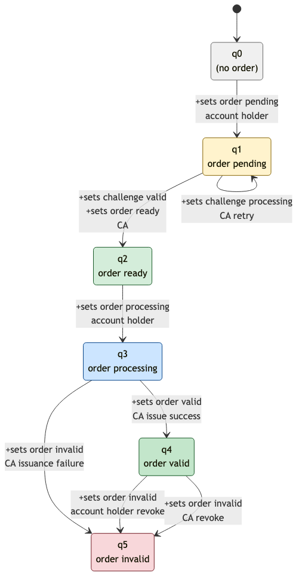

# RFC 8555 — ACME (Automatic Certificate Management Environment)

**RFC:** [RFC 8555](https://www.rfc-editor.org/rfc/rfc8555)  
**Status:** Phase 2 complete  
**Pilot order:** 2

## Summary

ACME automates certificate issuance between a certificate authority (CA) and an account holder. The normative core is a finite-state workflow: create order → authorize domain → finalize order → receive certificate.

## Contract Files

| File | Purpose |
|---|---|
| [model/default.modality](./model/default.modality) | Witness LTS governing model |
| [diagrams/acme-issuance.png](./diagrams/acme-issuance.png) | Witness LTS diagram (source: [acme-issuance.mmd](./diagrams/acme-issuance.mmd)) |
| [rules/governance.modality](./rules/governance.modality) | Fourteen governance formulas (nine temporal + five structural) |
| [review-benchmark/](./review-benchmark/) | Narrow source-clause review-bundle fixture for `newOrder`, authorization validation, and finalize |
| [review-benchmark/path-write-crosswalk.md](./review-benchmark/path-write-crosswalk.md) | Reviewer crosswalk from the abstract review fixture to the path-write corpus |
| [lean/](./lean/) | Lean 4 mirror of model + governance props |
| [normative-core.md](./normative-core.md) | RFC → obligation mapping |
| [synthesis-notes.md](./synthesis-notes.md) | Verification notes and test command |

## Parties

| Role | Modality path | Responsibility |
|---|---|---|
| Account holder | `/users/account_holder.id` | Owns ACME account, requests certificates |
| Certificate authority | `/users/certificate_authority.id` | Issues and revokes certificates |
| Authoritative server | `/users/authoritative_server.id` | Proves domain control (out of scope for wire format) |

## State paths

RFC §7.1.6 lifecycle is stored on durable paths (not witness node names):

### `/order/status.text`

| Value | Meaning |
|---|---|
| *(unset)* | No order |
| `pending` | Order created; authorizations/challenges in progress |
| `ready` | All authorizations valid; finalize allowed |
| `processing` | Finalize submitted; CA issuing certificate |
| `valid` | Certificate issued |
| `invalid` | Revoked |

### `/challenge/status.text`

| Value | Meaning |
|---|---|
| `pending` | Challenge issued |
| `processing` | Client responded; CA may validate (retries at q1, §8.2) |
| `valid` | Authorization valid |

Closed-enum rules use `always([-sets(path, A)] false | [-sets(path, B)] false | …)` — `[-sets(path, v)] false` means the value at `path` must be `v`; OR lists the allowed RFC literals.

The witness model uses opaque nodes `q0`…`q5` (one per order status). Each order status change uses `+sets(/order/status.text, …)`; pending-phase challenge steps use `+sets(/challenge/status.text, …)` on self-loops at `q1`.



Regenerate from [diagrams/acme-issuance.mmd](./diagrams/acme-issuance.mmd):

```bash
cd experiments/ietf-autoformalization/rfc8555-acme/diagrams
npx -y @mermaid-js/mermaid-cli -i acme-issuance.mmd -o acme-issuance.png -b white
```

## Path writes (contract vocabulary)

| Path write | Actor | Description |
|---|---|---|
| `+sets(/order/status.text, "pending")` | Account holder | Submit certificate order |
| `+sets(/challenge/status.text, "pending")` | CA | Provide domain validation challenge |
| `+sets(/challenge/status.text, "processing")` | Account holder / CA | Complete challenge / validation retry |
| `+sets(/challenge/status.text, "valid")` | CA | Authorization valid |
| `+sets(/order/status.text, "ready")` | CA | All authorizations valid |
| `+sets(/order/status.text, "processing")` | Account holder | Submit CSR (finalize) |
| `+sets(/order/status.text, "valid")` | CA | Issue certificate |
| `+sets(/order/status.text, "invalid")` | CA | Issuance failure |
| `+sets(/certificate/revoked.text, "true")` | Account holder or CA | revokeCert (§7.6) |

## Verification

Modality (model checker):

```bash
cd rust/modality-lang && cargo test acme_rfc8555 -- --nocapture
```

Lean (witness path + governance bundle):

```bash
cd experiments/ietf-autoformalization/rfc8555-acme/lean && lake build Acme8555
```

See [lean/README.md](./lean/README.md) for the Modality ↔ Lean mapping.

Synthesis review benchmark:

```bash
MODALITY_BIN=/path/to/modality tests/language/check-acme-review-benchmark.sh
```

The benchmark intentionally covers four narrow RFC 8555 source clauses:
`newOrder` (§7.1.4), authorization validation (§7.1.5), finalize (§7.4),
and certificate issuance (§8).
It checks that the parser-backed rule synthesis bundle preserves the reviewer
source clauses, extracted `+ACME_CREATE_ORDER`, `+ACME_VALIDATE_AUTHORIZATION`,
`+ACME_FINALIZE_ORDER`, and `+ACME_ISSUE_CERTIFICATE` actions, account-holder
and CA signature predicates, verifier status, explicit external assumptions, and
known gaps. It uses explicit Boolean formula syntax instead of implication sugar.
It does not claim that
DNS/HTTP validation, CSR soundness, CA policy, WebPKI trust, or the full
path-write ACME corpus are synthesized end to end. The
[path-write crosswalk](./review-benchmark/path-write-crosswalk.md) records the
current reviewer decision: the abstract `newOrder`, authorization-validation,
finalize, and issuance actions are conceptually aligned with
`+sets(/order/status.text, "pending")`,
`+sets(/challenge/status.text, "valid")`,
`+sets(/order/status.text, "processing")`,
`+sets(/order/status.text, "valid")`, and matching signature predicates, but
readiness, authorization, prior-order, issuance-ordering, closed-enum, and
invalid-order authority constraints still live in the
hand-authored path-write corpus.

## Modality Mapping Notes

- Witness LTS uses opaque q0…q5 aligned to `/order/status.text`
- Linear ordering with challenge self-loops at q1 and revocation branch
- Authorization formulas use `signed_by` on transitions
- `+sets(/certificate/in_use.text, "true")` is a governance placeholder blocked after order `invalid` or certificate revoke

## Out of Scope

- JWS signing, challenge response wire format, X.509 encoding, rate limits, directory discovery

## See Also

- [IETF autoformalization plan](../../../docs/progress/IETF_AUTOFORMALIZATION_PLAN.md)
- [Trustless escrow tutorial](../../../tutorials/trustless-escrow/) — similar multi-party contract pattern
