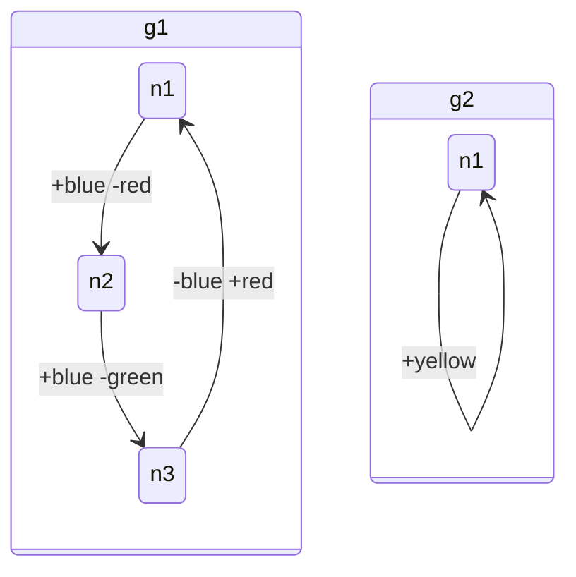

# Modality Language Parser

This crate provides a parser for the Modality temporal logic language, specifically for parsing `.modality` files that contain LTS (Labeled Transition System) models.

## Features

- Parse `.modality` files containing model definitions
- Support for multiple parts per model
- Support for transitions with properties (signed properties with + or -)
- Handle comments and empty lines
- Robust error handling
- **Two parser implementations:**
  - Hand-written parser (robust and battle-tested)
  - LALRPOP-based parser (grammar-driven)
- **Mermaid diagram generation** for visualizing models

## Language Specification

The formal syntax of the Modality language is defined by a BNF grammar. See [BNF.md](BNF.md) for the complete Backus-Naur Form specification.

## Usage

### Basic Usage

```rust
use modality_lang::{parse_file, parse_file_lalrpop};

// Parse from file using hand-written parser
let model = parse_file("path/to/model.modality")?;

// Parse from file using LALRPOP parser
let model = parse_file_lalrpop("path/to/model.modality")?;

// Parse from string content
let content = r#"
model MyModel:
  graph g1:
    n1 --> n2: +blue
    n2 --> n3: -red
"#;
let model = parse_content(content)?;
```

### Multiple Models

```rust
use modality_lang::parse_all_models_lalrpop;

// Parse all models in a file using LALRPOP
let models = parse_all_models_lalrpop("path/to/models.modality")?;
for model in models {
    println!("Model: {}", model.name);
}
```

### Mermaid Diagram Generation

```rust
use modality_lang::{parse_file_lalrpop, generate_mermaid_diagram, generate_mermaid_diagrams};

// Parse a model and generate a Mermaid diagram
let model = parse_file_lalrpop("path/to/model.modality")?;
let diagram = generate_mermaid_diagram(&model);
println!("{}", diagram);

// Generate diagrams for multiple models
let models = parse_all_models_lalrpop("path/to/models.modality")?;
let combined_diagrams = generate_mermaid_diagrams(&models);
println!("{}", combined_diagrams);

// Generate a styled diagram
let styled_diagram = generate_mermaid_diagram_with_styling(&model);
println!("{}", styled_diagram);
```

### Example Models

The parser supports the following syntax:

```modality
// Simple model with one transition
model InitialModel:
  part g1:
    n1 --> n1

// Model with properties
model Model3:
  part g1:
    n1 --> n2: +blue
    n2 --> n3: +blue

// Model with multiple properties
model Model4:
  part g1:
    n1 --> n2: +blue -red
    n2 --> n3: +blue -green
    n3 --> n1: -blue +red

// Model with multiple parts
model Model4:
  part g1:
    n1 --> n2: +blue -red
    n2 --> n3: +blue -green
    n3 --> n1: -blue +red
  part g2:
    n1 --> n1: +yellow
```

## Parser Implementations

### Hand-written Parser
- **File**: `src/parser.rs`
- **Functions**: `parse_file()`, `parse_content()`
- **Features**: Robust, handles edge cases well
- **Use case**: Production parsing

### LALRPOP Parser
- **File**: `src/grammar.lalrpop`, `src/lalrpop_parser.rs`
- **Functions**: `parse_file_lalrpop()`, `parse_content_lalrpop()`, `parse_all_models_lalrpop()`
- **Features**: Grammar-driven, supports multiple models
- **Use case**: Grammar-based parsing, multiple model support

## Mermaid Diagram Generation

### Basic Diagram Generation
- **Function**: `generate_mermaid_diagram(model: &Model) -> String`
- **Features**: Generates standard Mermaid state diagrams
- **Output**: Mermaid-compatible state diagram syntax

### Multiple Model Diagrams
- **Function**: `generate_mermaid_diagrams(models: &[Model]) -> String`
- **Features**: Generates diagrams for multiple models with comments
- **Output**: Combined Mermaid syntax for all models

### Styled Diagrams
- **Function**: `generate_mermaid_diagram_with_styling(model: &Model) -> String`
- **Features**: Includes CSS styling classes for visual enhancement
- **Output**: Mermaid syntax with custom styling

### Diagram Features
- **States**: All states/nodes are represented as state boxes
- **Transitions**: Arrows show state transitions within each graph
- **Properties**: Edge labels show transition properties (e.g., ` : +blue -red`)
- **State Groups**: Multiple parts are grouped in isolated state containers
- **Graph Isolation**: Each graph is completely isolated - no transitions between parts
- **State Naming**: Multiple parts use prefixed state names (e.g., `g1.n1`, `g2.n1`) to prevent conflicts
- **Styling**: Optional CSS classes for visual customization

### Example Mermaid Output


**Note**: In the above example, `g1` and `g2` are completely isolated parts. States in `g1` (g1.n1, g1.n2, g1.n3) cannot transition to states in `g2` (g2.n1), and vice versa. Each graph represents an independent LTS (Labeled Transition System). The prefixed naming (g1.n1, g2.n1) makes the graph isolation explicit and prevents naming conflicts. Properties are space-separated in transition labels.

## Data Structures

### Model
Represents a complete model containing multiple parts.

```rust
pub struct Model {
    pub name: String,
    pub parts: Vec<Graph>,
}
```

### Graph
Represents a graph within a model containing transitions.

```rust
pub struct Graph {
    pub name: String,
    pub transitions: Vec<Transition>,
}
```

### Transition
Represents a transition between nodes with optional properties.

```rust
pub struct Transition {
    pub from: String,
    pub to: String,
    pub properties: Vec<Property>,
}
```

### Property
Represents a property with a sign (+ or -).

```rust
pub struct Property {
    pub sign: PropertySign,
    pub name: String,
}

pub enum PropertySign {
    Plus,
    Minus,
}
```

## Examples

See the `examples/` directory for working examples:

- `parse_example.rs` - Basic parsing example
- `parse_all_models.rs` - Parse all models in a file
- `compare_parsers.rs` - Compare hand-written vs LALRPOP parsers
- `lalrpop_example.rs` - LALRPOP parser with multiple models
- `mermaid_example.rs` - Mermaid diagram generation

Run examples with:
```bash
cargo run --example parse_example
cargo run --example parse_all_models
cargo run --example compare_parsers
cargo run --example lalrpop_example
cargo run --example mermaid_example
```

## Grammar

The LALRPOP grammar (`src/grammar.lalrpop`) defines the syntax:

```
Model: Model = {
    <model:ModelDecl> => model
};

ModelDecl: Model = {
    "model" <name:Ident> ":" <parts:Part*> => {
        let mut model = Model::new(name);
        for part in parts {
            model.add_part(part);
        }
        model
    }
};

Part: Part = {
    "part" <name:Ident> ":" <transitions:Transition*> => {
        let mut part = Part::new(name);
        for transition in transitions {
            part.add_transition(transition);
        }
        part
    }
};

Transition: Transition = {
    <from:Ident> "-->" <to:Ident> => { ... },
    <from:Ident> "-->" <to:Ident> ":" <properties:PropertyList> => { ... }
};

PropertyList: Vec<Property> = {
    <property:Property> => vec![property],
    <properties:PropertyList> <property:Property> => { ... }
};

Property: Property = {
    "+" <name:Ident> => Property::new(PropertySign::Plus, name),
    "-" <name:Ident> => Property::new(PropertySign::Minus, name)
};
```

## Error Handling

The parser returns `Result<Model, String>` where errors are descriptive strings indicating what went wrong during parsing.

Common error cases:
- Invalid model declaration format
- Invalid graph declaration format  
- Invalid transition format
- Missing or invalid property signs
- Empty property names

## Building

The LALRPOP parser is automatically generated during the build process. The build script (`build.rs`) handles the grammar compilation.